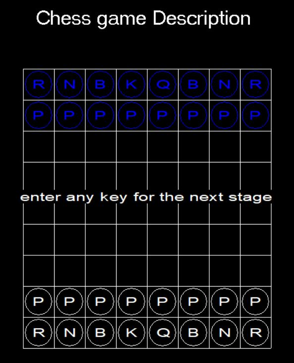
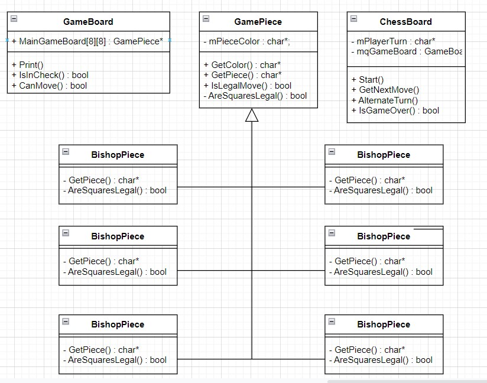
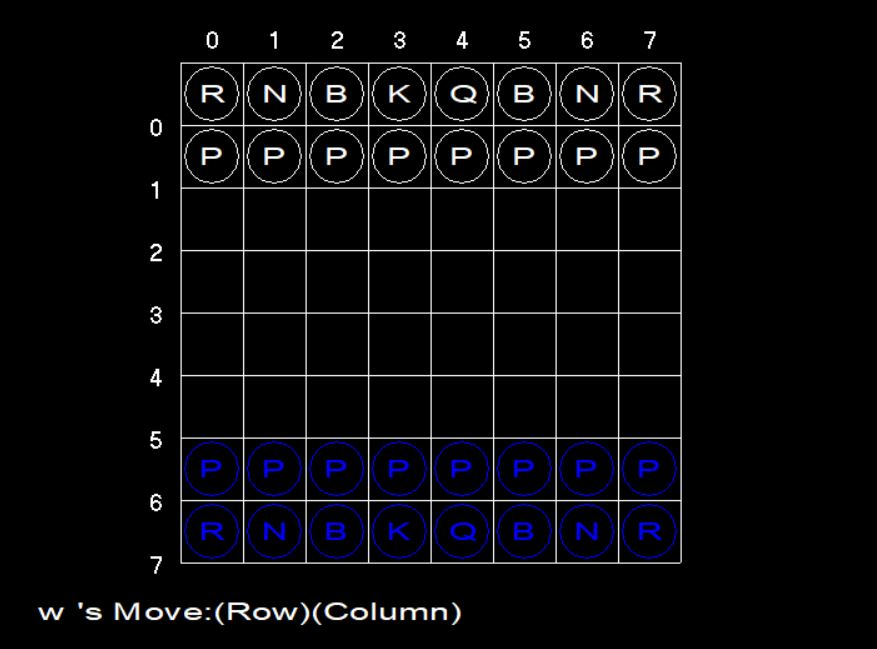

# __*Sw_TermProject*__

* ### 이번 프로젝트에서는 C++을 사용하여 2인용 체스를 구현했습니다. 게임은 C++의 객체 지향 방식을 염두에 두고 C++로 설계되었습니다.(Visual Studio 2022 환경에서 실행)

 

  

 

 

* ### 기본 클래스, 즉 **Gamepiece** 클래스에는 2개의 순수 가상 함수가 있습니다. 이 함수들은 기본 클래스를 확장하는 사람이 재정의해야 하기 때문에 코드 상에서 파생클래스들(ex 각 Pieces)코드로 반영된 모습을 보실 수 있습니다.
* ###  Getpiece와 AreSquareLegal은 기본 클래스의 2가지 가상 함수입니다.

## Class Diagram

  

Class|Description
:--|:--
**GameBoard**|화면에 출력하는 기능과 함께 각 piece 들의 상태 값을 인식, 값을 반환함   **void Print()**  : print game board and pieces **bool IsInCheck**(char* PieceColor) : check if there is King, and choose the winner __bool CanMove(char* PieceColor)__ : check the validation of piece movements and move
**GamePiece**|게임에서 사용하는 각 piece 들의 값 초기화와 piece 들의 상태 값을 가져옴  **mPieceColor(PieceColor)** : initialize the color of the pieces  __virtual char* GetPiece()__  : return the name of the piece(ex-King -> "K")  __char* GetColor()__ : return the color (black or white) of the piece  __bool IsLegalMove(생략)__ : return the result(true/false) of user input validation with each pieces movement 
**ChessBoard**|전체 게임을 진행시킴  __ChessBoard(): mcPlayerTurn("w")__ : initialize the start user(white) __void Start()__ : run the game __void GetNextMove(GamePiece* GameBoard[8][8])__ : get user input and change the location of the piece __void AlternateTurn()__ : change the turn of black (printed in blue color) and white __bool IsGameOver()__ : stop the screen and ends the game
**Each Pieces**(Knight, Bishop, Rook, Queen, King, Pawn)|전체 자신의 이름 값과, 그에 해당하는 이동 결과 값을 반환함  __virtual char* GetPiece()__ : return the piece name __bool AreSquaresLegal(생략)__ : Valid moves for each piece are checked and the resulting value is returned.

## In Game

  

## 각 기능별 알고리즘 설명
### 8 * 8 각 Piece 클래스를 담을 수 있는 배열을 사용하여 가상의 체스 판(Mainboard 배열 생성)을 만들고 함수들을 접근 시켜 게임을 진행하였다.
 

### 주요 기능들의 알고리즘을 동작 순서대로 살펴보면 다음과 같다.
 

1. GameBoard() & void Print() 함수 사용(GameBoard class)
위 GameBoard 생성자에서 8*8 배열에 각 체스 말들을 위치에 맞게 초기화 한 후 Print() 함수는 매번 그 값을 읽어 화면상에 보여준다. 

2.  Start() 함수 사용(ChessBoard class)
Start() 함수는 게임이 끝나기 전까지 (IsGameOver() != 1) 아래 순서로 동작을 진행시킨다
  

Function|Description
--|--
GetNextMove()|사용자의 입력을 받고 Print 함수를 실행 시켜 MainBoard[8][8]와 스크린상에 출력시킨다
AlternateTurn()|Black/White 순서를 바꾼다
IsGameOver() & IsCheck|IsCheck 는 8*8배열 상에서 사용자의 입력을 받고 King 이 사라지는 순간 true 값을 반환, IsGameOver 의 **return 값을 1로 만든다**. 만약 King 이 배열 상에서 존재하면 다시 GetNextMove() 함수를 실행시킨다 

